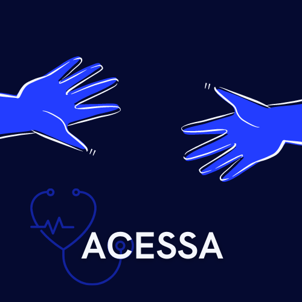

<h1 align="center">
    <br>
    <p align="center">Projeto Final - {Reprograma} <p>   
</h1>
<p align="center">

</p>
<br>
<h2>📚Justificativa</h2>
<br>
<p align="justify">Para quem não me conhece meu nome é Ravena e atuo como Intérprete de LIBRAS na rede estadual de ensino desde 2011. A autonomia de pessoas surdas, sempre foi para eu um tema de grande interesse e sensibilidade, pois as pessoas com deficiência são tema de discussões em diferentes níveis, sempre com o objetivo de que tenham equidade social, educacional e de saúde uma vez que são um número expressivo da população. Curitiba, tem aproximadamente 17 mil pessoas surdas segundo dados do IBGE, Censo de 2010 e no Brasil esses números chegam a 5,1% da população nacional. Por ser uma comunidade minoritária linguística e culturalmente, os surdos enfrentam inúmeras barreiras na acessibilidade a diversos serviços, em especial nos serviços de saúde. 
<p align="justify">Diante deste contexto surge a necessidade de investigação dos principais obstáculos
enfrentados pelos surdos referentes ao acesso à
saúde.Diversos trabalho sitam que o maior  desafio de atender o sujeito surdo nas unidades
de saúde se caracteriza, principalmente pela barreira
comunicacional.  É importante
ressaltar que a grande maioria da população surda não
tem conhecimento da Língua Portuguesa, que possui
o vocabulário e a gramática completamente diferentes
da Língua Brasileira de Sinais (LIBRAS), sua primeira
língua, tornando a comunicação escrita cheia de
obstáculos, já que esta deve ser feita com termos de
fácil compreensão e linguagem simplista. Muitas vezes a pessoa surda precisa ir acompanhada de uma familiar as consultas para que seja compreendido.
<p align="justify"> A equidade no acesso aos serviços de saúde é pouco notada, pois ainda existem pessoas ou questões invisíveis na
saúde, resultado da invisibilidade social. A pessoa surda se encontra nesta parcela da população que não consegue atendimento
igualitário nos sistemas de saúde, sendo marginalizada da sociedade e dos serviços.  A comunidade surda sente necessidade de maior
inclusão, em especial na área  da saúde para que esses tenham  autonomia para cuidar de
si próprios e até mesmo de outras pessoas. 

<ul><p align="justify"><i>Ir ao médico, é sempre um desafio para mim, porque não sei o que vou esperar a reação do médico que vai atender um surdo. Se for o médico da família é outra coisa, já sabe como comunica e me conhece  Muitas vezes acontece os médicos não sabem como comunicar um surdo, sempre digo para escrever um papel. Infelizmente há um problema ,as letras dos médicos não são bonitas, escreveram rápidos, poucos perceberam. Sempre fico ansiosa de ir ao médico porque não sei como reage na presença do paciente surdo.  Ja levei um intérprete  uma consulta por próprio médico pediu para me explicar melhor. Como estamos na pandemia, é o mais complicado por ser obrigatório de usar a máscara, traz uma grande barreira de comunicação. Enquanto psicóloga, os médicos deviam ter a mente aberta pela forma como comunicar os surdos, precisam de procurar as alternativas para comunicar, pode ser escrever, ou desenhar ou mímica. 
<p align="justify">Deise Bordignon, Psicóloga Surda/Professora de LIBRAS.
</i></ul>

Referências Bibliográfica:
-[1](http://www.seer.unirio.br/index.php/cuidadofundamental/article/view/2989)
-[2](https://www.scielo.br/j/rcefac/a/Lr7dq73TcmLt3GSsxv3H75J/abstract/?lang=pt)
-[3](https://www.ibge.gov.br/estatisticas/sociais/populacao.html)
-[4](https://www.scielo.br/j/sausoc/a/gPyFKXDJZ4sTSqMtfVgBzSF/?format=pdf&lang=pt)
</p>
<h2>📚Descrição da API ACESSA</h2>
<br>
<p align="justify">O projeto consiste em uma API REST que permite ao usuário buscar profissionais da saúde que sejam acessíveis em LIBRAS. A ideia é que aplicativo atenda a demanda da comunidade surda. 

*OBS: Os profissionais são ficticios.
<br>
<h2>📚Objetivos</h2>
<br>
<p align="justify">-Cadastrar profissionais da área da saúde que atendam a comunidade surda usando sua lígua materna(LIBRAS).
<p align="justify">-Possibilitar ao usuário comentar sobre o profissional e deixar like.
<p align="justify">-Simplificar a vida de pessoas surdas, oportunizando o acesso inclusivo  aos processos de saúde.

<br>
<h2>💻Tecnologias utilizadas no projeto</h2>

- [JavaScript](https://www.javascript.com/)
- [Git/Github](https://github.com/)
- [Node.js](https://nodejs.org/en/)
- [MongoDb](https://www.mongodb.com/)
- [MongoCompass](https://www.mongodb.com/pt-br/products/compass)
- [MongoDBatlas](https://www.mongodb.com/cloud/atlas)
- [Postman](https://www.postman.com/)
- [Vscode](https://code.visualstudio.com/)
- [Heroku](https://dashboard.heroku.com/apps)

<br>
<h2>💻Pacotes Utilizados</h2>

- [Express](https://expressjs.com/pt-br/)
- [Nodemon](https://nodemon.io/)
- [dotenv](https://www.npmjs.com/package/dotenv)
- [Mongoose](https://mongoosejs.com/)
- [cors](https://www.npmjs.com/package/cors)
<br>

<h2>📁Arquitetura MVC</h2>

```
 📁 projetoravenamaia:
   |-  📁 imagens
   |-  📁 node_modules
   |-  📁 src
   |    |
   |    |- 📁 controller
   |         |- 📑 professionalController.js
   |         |- 📑 userController.js
   |
   |    |- 📁 database
   |         |- 📑 projetoConfig.js
   |
   |    |- 📁 models
   |         |- 📑 professionalSchema.js
   |         |- 📑 userSchema.js
   |
   |    |- 📁 routes
   |         |- 📑 professionalRoutes.js 
   |         |- 📑 userRoutes.js
   |
   |    |- 📑 app.js
   |
   |
   |- 📑 .env
   |- 📑 .env.example
   |- 📑 .gitignore
   |- 📑 package-lock.json
   |- 📑 package.json
   |- 📑 Procfile
   |- 📑 README.md
   |- 📑 server.js
````

<br>


<h2>🔃Rotas</h2>

-Local: http://localhost:8080 <br>
-Heroku: https://projetofinal-reprograma-ravena.herokuapp.com <br>
*Para acessar usuários:https://projetofinal-reprograma-ravena.herokuapp.com/user/<br>

*Para acessar profissionais:https://projetofinal-reprograma-ravena.herokuapp.com/professional/ <br>

*Para acessar as rotas use o [Postman](https://www.postman.com/)

<h3>🔃Demandas das Rotas de Profissionais</h3>

| Método HTTP  | Endpoint              | Descrição                                  |
| ------------ | --------------------- | ----------------------------------------- |
| GET          | `/professional/all`         | Retorna todos os profissionais cadastrados               |
| GET          | `/professional/professional`      | Retorna um profissional  pelo nome    |
| GET         |`/professional/specialty`     | Retorna um profissional  pela especialidade                    |
| GET       | `/professional/district`    | Retorna um profissional da saúde por bairro        |
| GET        | `/professional/:id`     | Retorna um profissional da saúde por id  |                    |
| POST          | `/professional/create`     | Cria/cadastra um novo profissional da saúde        |
| POST       | `/professional/:id/like`      | Dar like em um profissional 
| PUT          | `/professional/:id`      | Atualiza/Altera informações de um profissional       |
| DELETE       | `/professional/:id`      | Remove  um profissional da saúde   


<br>
<h3>🔃Demandas das Rotas de Usuários</h3>

| Método HTTP  | Endpoint              | Descrição                                  |
| ------------ | --------------------- | ----------------------------------------- |
| GET          | `/user/all`         | Retorna todos os comentários               |
| GET          | `/user/:id`     | Retorna um comentário por id    |
| POST         | `/user/create`   | Cria um novo comentário                    |
| PUT          | `/user/:id`     | Arualiza/Altera informações de um comentário        |
| DELETE      | `/user/:id`     | Remove comentário           |

<br>

<h2>🚧 Futuras implementações</h2>

<br>

*  Sistema de login.
*  Disponibilizar a interface na versão em LIBRAS.
*  Implementação de código HTML e CSS, construção da interface para possibilitar a interação do usuário com aplicação.
<br>

Autora: [Linkedln](https://www.linkedin.com/in/ravena-maia-367a45162/)

<br>
<h2>Obrigada pela atenção!</h2>
<br>


